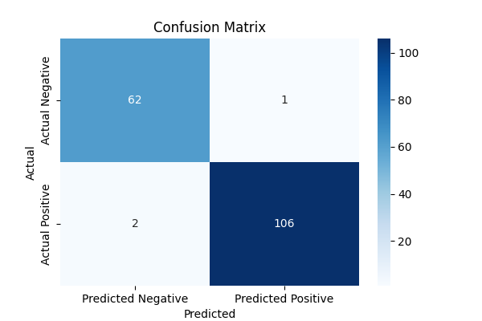

# 🩺 Breast Cancer Diagnosis Prediction (Logistic Regression)

This project uses the **Breast Cancer Wisconsin (Diagnostic) Dataset** to predict whether a tumor is **malignant (M)** or **benign (B)** using a Logistic Regression model.

---

## 📊 Dataset

- **Source:** [Breast Cancer Wisconsin (Diagnostic) Dataset](https://www.kaggle.com/datasets/uciml/breast-cancer-wisconsin-data)  
- **Features:** Computed from digitized images of a fine needle aspirate (FNA) of breast mass, describing characteristics of the cell nuclei.  
- **Classes:**  
  - `M` → Malignant  
  - `B` → Benign  

**Note:** Due to Kaggle licensing, the dataset file (`data.csv`) is **not included in this repo**.  
You can download it manually from the [dataset link](https://www.kaggle.com/datasets/uciml/breast-cancer-wisconsin-data).

---

## 🚀 Project Workflow

1. **Data Preprocessing**
   - Removed irrelevant columns (`Unnamed: 32`, `id`).
   - Converted `diagnosis` column from `M`/`B` to 0/1.
   - Standardized features using `StandardScaler`.

2. **Modeling**
   - Split data into **train (70%)** and **test (30%)** using `train_test_split`.
   - Trained a **Logistic Regression** model (`sklearn.linear_model.LogisticRegression`).

3. **Evaluation**
   - **Accuracy:** `0.98`  
   - **Classification Report:** Precision, Recall, F1-score metrics included.  
   - **Confusion Matrix:** Visualized with Seaborn heatmap.

---

## 📈 Confusion Matrix

Example of confusion matrix for the test set:



---

## ⚙️ Installation

1. Clone the repo:

```bash
git clone https://github.com/yourusername/CodeAlpha_breast-cancer-logistic-regression.git
cd CodeAlpha_breast-cancer-logistic-regression
 ```
2. **Install dependencies:**:   
```commandline
pip install -r requirements.txt
```
📂 Files in This Repo

- breast_cancer_logistic_regression.ipynb

- breast_cancer_model.joblib

- Main notebook with all steps (EDA, preprocessing, modeling).

- requirements.txt — Python dependencies.

## 👨‍💻 Author

Yoseph Negash

📧 yosephn22@gmail.com

📅 2025
